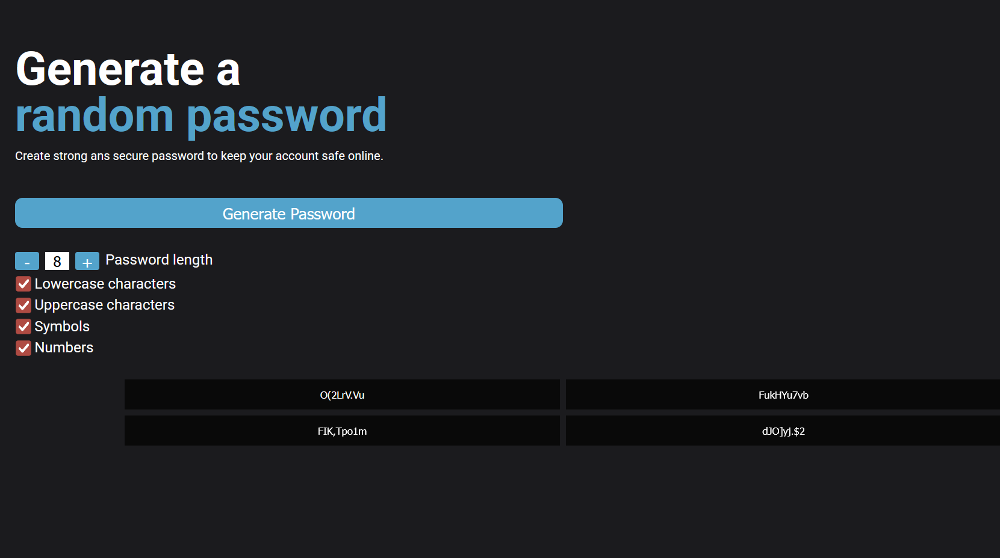

# Random Password Generator

This project is part of the Scrimba's Solo Project section of the "The Front-End Developer Path", where the student is required to finish the project on their own without extensive help.
This application is a program that allows you to generate a random password, then lets you copy the password for usage onto your clipboard.

## Table of contents

- [Overview](#overview)
  - [The challenge](#the-challenge)
  - [Screenshot](#screenshot)
  - [Links](#links)
- [My process](#my-process)
  - [Built with](#built-with)
- [Author](#author)

## Overview

### The challenge

- Fully responsive Website for small, medium and large screen devices.
- Generate completely random password.
- Give user 4 random passwords to choose from.
- User should be able to customize their password: length, lowercase, uppercase, symbols, numbers, etc.
- The user should be able to copy their password on click.
- Developed first with the Mobile First methodology, then for desktop.
- Compatible with all mobile devices and with a beautiful and pleasant user interface.

### Screenshot

### Links

- Live Site URL: [Live](random-password-generator-scrimba.vercel.app)
- Repository URL: [Repo](https://github.com/gaga4l/Random-Password-Generator)

## My process

### Built with

- Semantic HTML5 markup
- CSS custom properties
- vanilla js
- Flexbox
- CSS Grid
- Mobile-first workflow

## Author

- Github - [Gaga](https://github.com/gaga4l)
- Linkedin - [Gaga](https://www.linkedin.com/in/gaga4l?utm_source=share&utm_campaign=share_via&utm_content=profile&utm_medium=android_app)
- Twitter - [Gaga](https://www.twitter.com/lelisa_8)

Thank God for everything!
